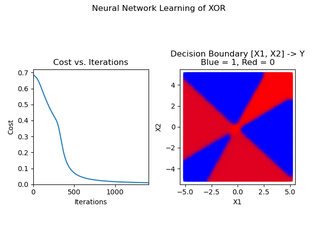

# Neural-Networks-From-Scratch

This is an implementation of feed-forward neural networks using only numpy (and matplotlib to plot from main)  
This implementation uses backpropagation and gradient descent to train.  
The math is too long for a readme, so here are some links:  
https://en.wikipedia.org/wiki/Backpropagation  
https://en.wikipedia.org/wiki/Gradient_descent   

# Training Examples
The main trains a network that has an architecture of (2,4,1) which means that the input layer has two neurons, the hidden layer has four neurons, and the output layer has one neuron. It trains the network on XOR, a simple function that is <u>not linearly seperable</u>. This means that the network has to come up with a somewhat complex hypothesis. For reference, the truth table of XOR is:  
(0,0) => 0  
(0,1) => 1  
(1,0) => 1  
(1,1) => 0   

Below are some graphs of the cost over every training iteration and the decision boundary created to simulate XOR.   

Here is the most simple solution, just draw an area down the line x=y:  
  

But, not all of them are so simple. Sometimes, you get curves like this:  
  

Or this:  
  

Or if you edit the code to zoom out a bit, you can get weird stuff like this:  
  

Alternatively, every once in a while, it can get stuck in local optima and just fail leaving something like this:  
  

Remember, this is all with an architecture of (2,4,1), these networks are capable of insanely complex hypothesis. Starting from the bottom and visualizing two inputs into a logic gate is a great way of showing how networks generate complexity.  

# To Run
. Have a working python environment with recent versions of numpy and matplotlib
. Download this repo and navigate to it in terminal
. Run "python main.py"
